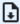

# Assets
Assets are the individual instances of an asset type. Say if we had an asset type cat, then we could have the assets ‘neko’, ‘muffins’ and ‘tiger’. While all 3 share the same properties, their values might be different as ‘neko’ could have black fur, ‘muffins’ a higher weight then the others and ‘tiger’ be a boy.

When creating an asset by pressing  at the bottom right of the screen, all pre-denoted properties can be filled in, but only those marked with the ‘value is required’ checkbox will have to be filled in before an asset can be made. Assets can also be created using flows. (See [Create (Incl. properties)](https://github.com/conneqtDocumentation/connectDocumentation/blob/main/Nodes/Assets/CreateByPayload.md)) And, the create asset buton can also be set to trigger one of these flows under the processes option of the view (see [displays](https://github.com/conneqtDocumentation/connectDocumentation/blob/main/Displays.md)). To the left of the screen we can filter to only show a certain selection of assets. (see [filters](https://github.com/conneqtDocumentation/connectDocumentation/blob/main/Filters.md))
The download button  at the top of the screen allows you to export a list of the assets in either a CSV or JSON file.

Standard, only the names of the assets are shown. But by clicking on the ‘+’ above the list, we can create a custom display. (see [displays](https://github.com/conneqtDocumentation/connectDocumentation/blob/main/Displays.md))
