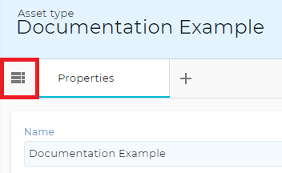
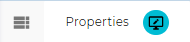
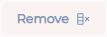
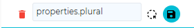
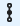
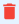

# **Assettypes**
Assettypes are the frameworks for assets. All the possible properties, as well as their base values, an asset can have can be set in the assettype. Multiple assets of the same assettype can exsits at the same time.

## Creating an asset type
An assettype can be created by clicking the add assettype button in the botom right corner.

This will result in an assettype containing all the standard properties included, but no custom properties have been added to it yet. Note that all but the 'name' property have been hidden.

# Editing an asset type
All the properties can be seen by pressing the table icon in the top left of the screen:

These properties can also be dragged into the asset while in eddit mode to have them displayed on the assettype screen. At the bottom of this list there is the option to add more properties. Existing properties can to a certain degree be edited by clicking on the pencil icon next to the property. Eddit mode is enabled by selecting the edit option next to the left most tab that will appear when the cursor is placed over it. Editing mode allows not only for new properties to be added and changed, but allows the asset type page to be used as a sub dashboard with the use of widgets.

### Property types
An asset type denotes all the properties of an asset. It has a few standard properties built in but custom properties can also be added.

**Standard properties:**
These properties are always included with an assettype. Removing one of these might result in errors.
| **Property** | **Stores** |
| --- | --- |
|Name|The name of the asset, must always have a base value as it denotes the name of the assettype|
|Icon|If an asset has an icon, it can be saved here.|
|Start date/time |  Date (and time) that somthing started.|
|End date/time| Date (and time) that somthing ended.|
|Placed inside (asset location)| When an asset is added to this property, this asset will take it's geo-location as its own.|
|Location| The geo-location of the asset.|
|In areas| All the areas that the assets geo-location is located in.|
|Bounds|The edge of an area.|
|Location constraint|Even the owner doesn’t know anymore. ¯\ _ _(ツ)__/¯|
|Map type|Not yet implemented.|
|Point on custom map|Coordinates on the custom map of the map type property.|

**Custom properties:**
| **Property** | **Stores** |
|---|---|
|Text| All text can be stored here, however it is not advised to place large amounts of text in a single property.|
|Integer number|A whole number. Cannot store decimal numbers.|
|Decimal number|A decimal numbers.|
|True/false|Stores either true, false or is empty.|
|Date and time| A date and time in string form|
|Assettype|Stores an asset type.|
|Asset|Stores an individual asset. One asset can be stored in multiple other assets|
|File| Stores a file. Can be used for images, videos, large text files, etc.|
|Flow reference| This is a reference to a Flow that can be used as a trigger.|

These types by default have only one value, but multiple values can be added when the ‘multi-value’ has been checked.
By checking the ‘value is required’ box, the value has to be added when creating a new asset of the assettype. Adding a default value is advised.
By checking the ‘Track modification history’ box, previous values and the time of change are stored. This can later be used to create graphs.
By making the value fixed, the value cannot be changed after it has been created.

#### Editor
The editor changes how the data of the property is collected and/or displayed.
When hide property in add popup is turned on it no longer shows a field to add a value to this property when creating a new asset

**Text**
- Text field: Type text in a single line
- Text area: Type text in multiple lines
- Phone number validation text field: may change the keyboard on mobile (depends on device)
- Color picker: changes the text field to a color picker.
- Email validation text field: may change the keyboard on mobile (depends on device)
- Url validation text field: may change the keyboard on mobile (depends on device)
- Icon picker: select an icon
- Use process: when changing value triggers Flow instead

**Numbers:**
- Numeric value: set a number
- Use process: when changing value triggers Flow instead

**True/False**
- Check-box: shows a checkbox
- Switch: shows a switch
- Use process: when changing value triggers Flow instead

**Date + Time**
- Date calendar and time picker: shows both
- Date calendar: only shows a calendar
- Time picker: only shows a digital clock time picker
- Use process: when changing value triggers Flow instead

**Asset type**
- Entity picker: select an Asset type
- Use process: when changing value triggers Flow instead

**Asset**
- Entity picker: select an Asset type
- Use process: when changing value triggers Flow instead
- Dropdown list: shows a dropdown list when changing values. A filter has to be set in the constraints.

**File**
- File upload: pick a file to upload
- Image upload: pick an image to upload
- Use process: when changing value triggers Flow instead

**Flow reference**
- Entity picker: Select a Flow
- Allow add new value: when checked, this adds the option to create a new Flow.

#### Display

Under display we find an option to choose the way of displaying the value. Leaving this on default, the property will be displayed as is. Where we can only change the color that it shows. Depending on the property type, we can also select different ways of display.

**Text**
- Icon: If the text is the name of an icon, the icon will show.
- colorBlock: Colors the background of the text according to the added colors
- Multi-line text: If the text is too long for a single line, line breaks are used.

**Numbers**
- Formatted: Set the number of decimals and add a unit

**True/false**
- Formatted: Set different terms to be used for true and false
- Custom: Create custom icons for true and false

**Date and time**
- Formatted: Set the way the date is formated

**File**
- Thumbnail (default): Shows a small image of the file provided
- Download link: Creates a link from where the file can be downloaded.

#### Triggers
A flow can be added to be triggered every time the property meets certain conditions.

##### Editing a trigger:
- Asset type: The asset type the trigger is linked to
- Trigger property: The property the trigger is linked to
- Triggers.flow-name: The flow that is triggered
- When changed by: What the property has to be changed by to trigger the flow.

#### Maintenance
Set the value of the property across all the assets of this asset type that fall within the set filter: a batch update.

## Widgets
Widgets can also be added in eddit mode, turning the asset type page into a sub dashboard. This is done by clicking on the add widget button below the properties list.

See [widgets](https://github.com/conneqtDocumentation/connectDocumentation/blob/main/Widgets.md) for more information.

The add colomn button adds a new column to add widgets or property panels to. 

The remove column button removes them.

## Saving
Pressing the save button next to the name of the tab saves the layout and added properties. 

Pressing the bin button will delete the tab. __If a tab is not saved before the page is reloaded/exited the changes will not be stored!__

## Creating a new tab
Clicking the + next to the already existing tabs creates a new tab or dashboard. There are two types of dashboard. A column type where all the values are put below each other, and a tiles type that functions similar to the main dashboards. (see dashboard).

## Dashboard properties edit
Clicking the pencil at the top of the screen, the dashboard properties of the asset type can be edited.
Here, the name and icon of the page can be changed. Assets can also be linked to an external data source, using HTTP methods. This security measure allows for data storage outside of the databases of Conneqt, that is requested when the asset is opened so it can still be seen and changed within conneqt. It also allows setting the asset type to act as a choice list. This means that all the assets created using this type will only show up when choosing them as a choice-list. Say an assettype ‘Status’ has the assets ‘Ready’ and ‘Preparing’. Then status will e.g. be hidden in an asset type picker for a node that counts the assets, but will be visible when creating an asset property. Finally, the asset type can use a generation pattern for the names of its newly created assets. 

## Link to Assets
Clicking the Assets button  at the top of the screen will link to the list of the asset type’s assets. See [assets](https://github.com/conneqtDocumentation/connectDocumentation/blob/main/Assets.md) for more info.

## Link to dependent asset types
Clicking the dependency button  will link to a list of all the asset types that rely on the current asset type. 

## Link to triggers
Clicking on the connected triggers button  at the top of the screen will lead to a list of triggers linked to the asset type. It will show which Flows are triggered, what the property needs to be changed by for the trigger to activate and what type of change it is.

## Deleting an Asset type
Deleting an asset type can be done by pressing the bin symbol at the top of the screen.  This action cannot be undone. Make sure that no Flow or other asset(type) relies on the asset type to be deleted. Otherwise they might not work properly

