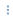

# Dashboards
A dashboard is a place where all the data processed by the tenant can be seen. A dashboard is created by clicking on the account button, hovering over dashboards and then scrolling down and clicking ‘create new dashboard’ 

The name as well as the amount of columns and rows can also be set. The amount of rows and columns is permanent. Widgets can then be placed on these tiles. They are not limited to a single tile. To add widgets, press the Dashboard settings button   in the top right of the screen. Here, the name and icon of the dashboard can be set too. A widget is placed by clicking on an empty tile. There are many different widgets (see individual [widgets](https://github.com/conneqtDocumentation/connectDocumentation/blob/main/Widgets.md)). The widget can be moved by dragging the move symbol  to another tile. The widget can be resized to span multiple tiles by dragging the dots  in the bottom right of the widget. 

A widget can be edited or removed by clicking the three dots   in the top right of the widget. The property setting of a widget will depend on its type. The widget settings will remain the same: The widget header text will be a title to appear on the widget, the text and background color change their respective queries, and the icon option allows for an icon to be added left of the header. Deleting a widget is permanent, even if the dashboard is not saved, which can be done by pressing the save dashboard button  where the settings button used to be. Pressing the remove button   will delete the dashboard, this cannot be undone. Finally, pressing the full screen button   will open the dashboard in fullscreen.

The default dashboard for both the browser client and the app can be set in the tenant settings under ‘default dashboard for new users’ and ‘Home-dashboard for the conneqt app’. This dashboard will then load when logging in or clicking the conneqt logo in the top left.

A dashboard can be added to the menu on the left by clicking the menu settings at the bottom left of the screen, clicking the ‘add widgets’ and then ‘link to dashboard’.
