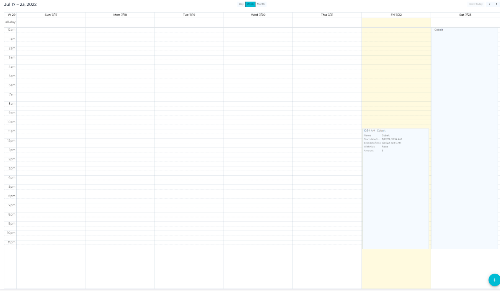
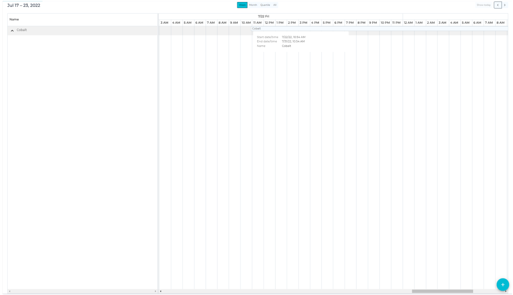
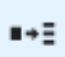
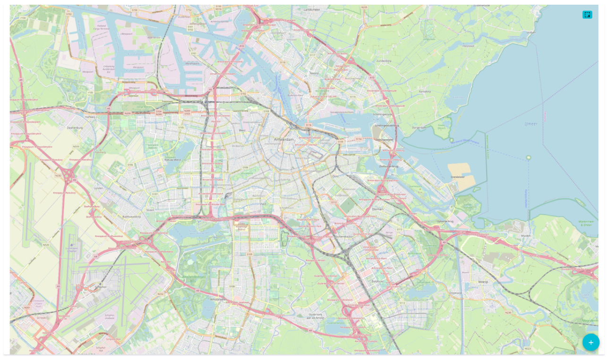
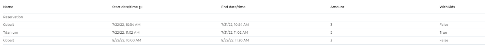
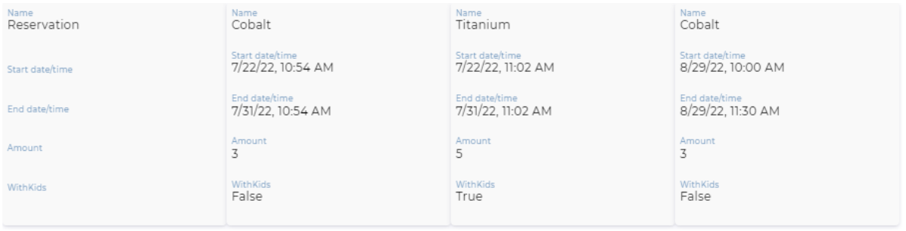

# Displays
When viewing assets of an asset type, there are 5 types of display:
- Date and time
- Timeline
- Map
- Table
- Tiles

Each type of display also has its own options to further customize the display

### Date and time / Timeline:
Date and time and Timeline will show a calendar or timeline where assets can be placed based on their start and end date/time (see standard properties) or other dates added to the asset. The main difference between these displays is the time that an asset takes, where date and time ranges from a few minutes to months, timeline ranges from weeks to a year.

This display can be customized with the following options:

|Settings||
|-|-|
|Property for header| The property that will be shown on a time block representing an asset|
|Hide Filters|Collapses the filters menu by default when turned on|
|On create, skip intermediate window|When creating a new asset, skips the window in which property values can be added and directly leads to the new assets page|

|Calendar / timeline settings||
|-|-|
|Property for begin date/time|The property that is used for setting the begin date and time|
|Property for end date/time|The property that is used for setting the end date and time|
|Calendar mode (day/week/month) / Timeline mode (week/month/quartile)|The default time period shown when opening the view|
|Collapse by default|Timeline assets are listed in their groups. If selected, all groups will be collapsed|
|Properties as grouping |Select the properties for the asset to be grouped on (assets with the same values for the selected properties will be added to the same group)|
|Property order|The order the grouping is done in. Useful for organizing timelines|

|Visible fields/columns||
|-|-|
|Properties|The properties that will be visible|
|Property order|The order in which the properties will be visible|

|Sort order| The property that the assets are sorted on|
|-|-|
|||

|Processes||
|-|-|
|Flow to use at ‘+’ button|Denotes what flow the program should follow when creating a new asset|
|View.flows|Adds a button  to run the selected flow, using the asset as the one executing the flow|
|Processes that will be available for batch actions|Adds a button  that will run the selected flow for all assets to the top right of the screen|

|Follow up options||
|-|-|
|Layout available as tab pages|Select the tabs of properties that are visible after selecting an asset in the asset|
|Activate dashboard|The tab that will first be opened|

|Store view||
|-|-|
|View is shown for| asset types / filters / everything|
|Selection menu based on 'View is shown for'|Select which items the view is available for|
|Translation file|Translations applied to the view|
|Name of this view|This is the only required setting|

### Map: 
The map allows you to quickly see where assets are located as long as they have a location stored.

|Settings||
|-|-|
|Property for header| The property that will be shown on a time block representing an asset|
|Hide Filters|Collapses the filters menu by default when turned on|
|On create, skip intermediate window|When creating a new asset, skips the window in which property values can be added and directly leads to the new assets page|
|Heat map|Adds a layer of coloration based on the values or frequency of assets in a certain area|

|Visible fields/columns||
|-|-|
|Properties|The properties that will be visible|
|Property order|The order in which the properties will be visible|
|Sort order|The property that the assets are sorted on|

|Processes||
|-|-|
|Flow to use at ‘+’ button|Denotes what flow the program should follow when creating a new assets|
|View.flows|Adds a button  to run the selected flow, using the asset as the one executing the flow|
|Processes that will be available for batch actions|Adds a button  that will run the selected flow for all assets to the top right of the screen|

|Follow up options||
|-|-|
|Layout available as tab pages|Select the tabs of properties that are visible after selecting an asset in the asset|
|Activate dashboard|The tab that will first be opened|

|Store view||
|-|-|
|View is shown for| asset types / filters / everything|
|Selection menu based on 'View is shown for'|Select which items the view is available for|
|Translation file|Translations applied to the view|
|Name of this view|This is the only required setting|

### Table / Tiles:

|Settings||
|-|-|
|Property for header| The property that will be shown on a time block representing an asset|
|Hide Filters|Collapses the filters menu by default when turned on|
|On create, skip intermediate window|When creating a new asset, skips the window in which property values can be added and directly leads to the new assets page|
|Layout cell panes|When turned on, it shows a grid designer. Cells are added by clicking the arrows, and they can be combined by dragging across them. The size of the cells is denoted by the numbers on the side. Using just numbers will denote the size in pixels, using ‘fr’ after a number turns it into fractions|
|||
|Height|The height of the complete grid in pixels|
|Width (tiles only)|The width of the complet grid in pixels|
|Property to show as text|The name of the property to be displayed in the selected cell|
|Cell color|The color of the background of the cell|
|Text color|The color of the text|
|Text size|The size of the text|
|Text alignment|The alignment of the text|
|Text weight|When checked, the text becomes emboldened|

|Visible fields/columns||
|-|-|
|Properties|The properties that will be visible|
|Property order|The order in which the properties will be visible|

|Sort order| The property that the assets are sorted on|
|-|-|
|||

|Processes||
|-|-|
|Flow to use at ‘+’ button|Denotes what flow the program should follow when creating a new asset|
|View.flows|Adds a button  to run the selected flow, using the asset as the one executing the flow|
|Processes that will be available for batch actions|Adds a button  that will run the selected flow for all assets to the top right of the screen|

|Follow up options||
|-|-|
|Layout available as tab pages|Select the tabs of properties that are visible after selecting an asset in the asset|
|Activate dashboard|The tab that will first be opened|

|Store view||
|-|-|
|View is shown for| asset types / filters / everything|
|Selection menu based on 'View is shown for'|Select which items the view is available for|
|Translation file|Translations applied to the view|
|Name of this view|This is the only required setting|

