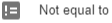

# Filters
Filters allow us to filter on certain asset types or assets. Depending on the type of the property you are filtering on, different filter options will be available. Opening the filter menu shows a list of all the filters in the tenant. Clicking a filter shows all the relevant data.
When creating a new filter, first the asset and property filters are set using the below listed filter options. After that a name can be given to a filter, as well as a scope. The scope can be set to three different modes:
- Single use: the filter can only be used in the place it was created
- Reusable: the filter can be used multiple times
- Main menu: the filter can be used multiple times but is listed under the main menu scope when searching filters. This is useful to separate important filters from general filters

All created filters can be found on the Filter page. Selecting a filter listed shows all the filters settings, as well as a neat list of all the sub filters used in the filter. It also lists where and how many times the filter is referenced

|Filter options|Options shown depend on the type of property|
|-|-|
|| Will give all that are the same as the filter value.|
||Will give all that are not the same as the filter value.|
||Will give all that start with a certain tag or text.|
||Will give all that do not start with a certain tag or text.|
|| Will give all that end with a certain tag or text.|
||Will give all that do not end with a certain tag or text.|
||Will give all that contain a certain tag or text.|
||Will give all that do not contain a certain tag or text.|
|| Will give all that do not yet have a value for the selected property.|
||Will give all that have a value for the selected property.|
||Will give all that fall within a certain distance of a selected position. Not yet fully implemented.|
||Will give all that have a lower value than the filter value. (In date, this is before filter date)|
||Will give all that have a lower or equal value to the filter value. (In date, this is before or on filter date)|
||Will give all that have a greater value than the filter value. (In date, this is after filter date)|
|| Will give all that have a greater or equal value to the filter value. (In date, this is after or on filter date)|
|| Will give all that contain a certain asset|
||Will give all that do not contain a certain asset|

Pressing the  symbol allows for more advanced filters to be written using java-script. Where ‘&&’ means ‘and’, || means ‘or’ and ‘!’ means ‘not’.
When creating a filter in a view:

 allows you to save the filter to be used later in widgets (see widgets)

 clears all filter settings.

