# Flows
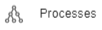

The flows are the ‘code’ of Conneqt. With flows, all the data within a conneqt tennant can be created and managed.  A flow is created by combining blocks known as nodes in order. When creating a new flow, a starting node is created in which the header of the flow can be changed by changing the ‘Unnamed process’ within the NodeExpression. Nodes are added by clicking the output dots on existing nodes, or dragged to them from the toolbox. This will also create a line or ‘path’ between these nodes. With these paths, the actions of the flow can be visualised. When using multiple outputs from one node, a decision tree can also be made that yield different results.

When clicking on a node, an edit screen opens up on the right. The first option will always be a name for the node. A good convention here is to use lowercase names. This will make more sense if the flow becomes complex enough that small bits of Javascript are used.

After that, Node specific options will follow. See the node specific pages listed below for these. Every node also has a NodeExpression. This field denotes what the node does, and may be altered to manipulate the behaviour or outputs of the node.

### Outputs
Below that, there is the Outputs tab. For some nodes outputs have already been created as they are expected to happen when executing the node. But all nodes can have up to 3 different kinds of output added to the list, and there is always the option to continue regardless of the result.

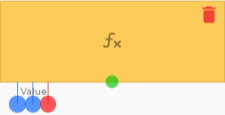

The ‘Specific result’ output will show up as a blue dot attached to the node with the specified value above it. This output will trigger in case the specified result matches the result of the node. Multiple of this output can be added
The ‘Any result’ output will also show up as a blue dot attached to the node, but this time without a value above it. This output will trigger in case the result is not empty (null) and not a value denoted in a ‘Specific result’ output. Only one of this output can be added.
The ‘Any error’ output will show up as a red dot attached to the node. This output will trigger in case the node returns an error. Only one of this output can be added. 
Whenever a node returns ‘null’ (noting), the flow stops at that node.
The green dot attached to the node does not have an assigned output, it will always trigger, regardless of the result. Even if the node returns null. It is not possible to have a node connected to the green dot and another output type, but it is possible to pass an output through the next node by attaching the node to pass it through to the green dot.

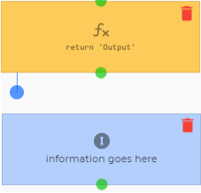 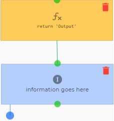

Finally, there is the Scheduled execution. Once this is enabled the node will only send the execution to the server without waiting for a reply. This is useful for optimisation. In the description, a tag can be added: ‘TagName’. This tag will show up on devices that have yet to sync all their data as a description of what still has to be synced

The remarks field can be used to leave notes on the nodes. A text bubble will show up on the node signifying that a remark was added.
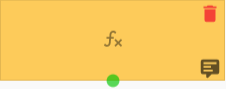

### Types of nodes
There are two main types of nodes:
Expression Nodes
User-Interaction nodes

The yellow Expression nodes are nodes in control of calculations and data manipulation. These handle all the behind the scenes and are all executed on the server. The expression could be a very simple comparison, but also a highly complex function. The result will stay available for the continued duration of the execution of the flow. Most can be referenced with the syntax:`Nodes.NodeName`, where NodeName is the name of the node calculating the value to reference. At times, nodes may have multiple outputs in what is called an array. If a specific output has to be referenced, it is done with:`Nodes.NodeName[X]`, where the X is the position of the desired value. Keep in mind that this is an Array position, thus the X for the first position is 0, for the second it’s 1, for the third it’s 2, etc. At times, nodes will output the data in a slightly different way. See the individual node pages for more information.

Once a flow is run, square brackets 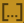 will appear on the bottom right of nodes. They will have dots if they contain a value, and thus can be referenced. Clicking on these will show a screen with all the information stored inside the node. Every step to the right is a branch, and all these trees are different for each node. Value stored in deeper levels of these branches has to be accessed specifically. (see individual nodes for more information)

The blue User Interface nodes are nodes that interact with the user, either by displaying something (an image, text, output value, etc.) or asking for an input. These nodes are especially useful when the flow has the user create an asset. These UI elements can be rendered in different kinds of clients. Eg. the angular portal, the conneqt xamarin app or (to an extent) in the telegram chat app. User interface nodes are first sent to the client before being rendered. No UI element is rendered on the Conneqt server. UI nodes are stacked and rendered at the same time when connected using the green dots. If the nodes are connected using other outputs, they wait for the certain output to be triggered. Using the clear screen Node removes all the UI elements on the screen. It is important to know that all these nodes are ‘stacked’ and executed all at once in a render cycle, these happen when the flow waits for user input. Thus if there are multiple nodes that show something, and then immediately after that a Clear screen node is used, none of the nodes will actually present something. Similarly, if a ‘Go to node’ node is used right after UI nodes that do not require user input -thus not triggering a render cycle- the UI elements won’t show up.

The red End nodes are nodes that trigger something outside the program, and cannot have an output. The purple Sub flow nodes start another flow and may have the result of that flow as its output. The green ‘Go to node’ node can be used to create loops and also cannot have an output.

## Triggers
Flows are called using triggers. These can be denoted in an Assettype, asset or another flow. Then they can be activated in 4 different ways
- On the creation of an asset
- On the changing of a property of an asset
- From another flow.
- Form a user interface (dashboards, asset lists, etc.)

While the first three happen in the background, the final activation method relies on a user pressing a button. A trigger is created by adding a flow as a trigger to a property of an asset(type) or using one of the subflow nodes in another flow. 

## Flow queue
When activating a trigger for all assets inside a filter with many assets or triggering multiple subflows at once, they cannot all be processed at the same time. Thus, they are moved to the queue. The process queue gives an overview of which processes have been planned, when they had been planned, their input data, when they started their execution and when they finished processing. 

## Flow results
When flows have been triggered, they are also stored inside the flow results. This will show the date and time the flow was run, the name of the flow, which asset it was assigned to, the current status of the flow, the version and whether the flow was a concept or had already been published.

|Interface||
|-|-|
|| The publish button publishes the flow. This means that the flow can be referenced and used by the rest of the tenant.|
|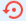|The discard concept button returns the flow to the last published version.|
|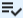| The load test data button allows for revision of older tests by loading them. This will fill in the returns of the nodes used in the flow, but does not run the flow again. This is only possible when the flow is left unchanged after running the test.|
|| The start test with asset button allows for manual selection of an asset to test the flow with|
|| The start test button starts running the flow without any given data.|
|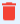| The remove button deletes the currently opened flow. This action cannot be undone.|
|| The add to dashboard is a quick way to add a trigger button to a dashboard.|
|| The properties button accesses the flow’s properties.
|| The toolbox contains all nodes that can be dragged and dropped into a flow.|
| The auto layout button reorganises the flow in an orderly manner.|
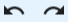| The undo and redo buttons undo and redo any action performed in the editor.|
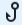| The generate token button allows for the flow to be triggered from a webapp. The link to this app will be : `https://api-test.conneqt.com/flow/pwa/?otp=` with the generated token added to the end.|
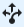| The generate subflow button turns all selected nodes into a subflow.|
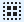| The group nodes button adds nodes to a Node form, a collapsable collection of nodes.|
| This means that the current flow has not been published and thus cannot be referenced anywhere.|
| This means that the current flow has been published and can be referenced and triggered anywhere in the tennant.|

|Flow properties settings||
|-|-|
|Name| The name of the flow|
|Icon| The icon of the flow|
|App name| A website that triggers a flow can be downloaded as an app on certain devices (android and windows, both via google chrome, have successfully been tested). This option sets the name of this app. If left empty the app will use the name of the flow as the name of the app.|
|Command (Telegram)| The command that will trigger the flow when using the telegram bot. |
|Input parameters| These can be set by certain triggers to have the flow start with certain parameters that can be accessed by its nodes.|
|FlowInfo| Information on the flow.|
|Node Names| A list of all the named nodes and their properties|

|List of all nodes:|Symbol|Description|
|---|---|---|
|[Aggregate](https://github.com/conneqtDocumentation/connectDocumentation/blob/main/Nodes/Assets/Aggregate.md)||Preform calculations on data.|
|[Batch update](https://github.com/conneqtDocumentation/connectDocumentation/blob/main/Nodes/Assets/Batch%20update.md)||Update a property of multiple assets of the same asset type at once.|
|[Create (incl. Property values)](https://github.com/conneqtDocumentation/connectDocumentation/blob/main/Nodes/Assets/CreateByPayload.md)|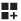|Create a new asset of an assettype and set its properties.|
|[Filter](https://github.com/conneqtDocumentation/connectDocumentation/blob/main/Nodes/Assets/FilterNode.md)||Generate a list of assets based on filter parameters.|
|[Find by identifier](https://github.com/conneqtDocumentation/connectDocumentation/blob/main/Nodes/Assets/FilterID.md)||Find an asset by its unique identifier.|
|[Find by property](https://github.com/conneqtDocumentation/connectDocumentation/blob/main/Nodes/Assets/FindProperty.md)|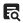|Find an asset by a unique property value.|
|[Multi-property update](https://github.com/conneqtDocumentation/connectDocumentation/blob/main/Nodes/Assets/MultiPropertyUpdate.md)|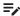|Update multiple properties of the same asset at once.|
|[Update](https://github.com/conneqtDocumentation/connectDocumentation/blob/main/Nodes/Assets/Update.md)|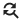|Update a property of an asset.|
||||
|[Message person using medium](https://github.com/conneqtDocumentation/connectDocumentation/blob/main/Nodes/Communication/MessagePersonUsingMedium.md)|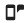|Send a message to someone who is part of the tennant using SMS, email or the Telegram chat app.|
|[MessageBird SMS](https://github.com/conneqtDocumentation/connectDocumentation/blob/main/Nodes/Communication/MessageBirdSMS.md)||Send an SMS to multipe people using the Messagebird API.|
|[SendGrid e-mail](https://github.com/conneqtDocumentation/connectDocumentation/blob/main/Nodes/Communication/SendGridEmail.md)||Send an email to someone using the SendGrid API.|
|[SendGrid Templated e-mail](https://github.com/conneqtDocumentation/connectDocumentation/blob/main/Nodes/Communication/SendGridTemplated.md)|| Send a Templated email to someone using the SendGrid API.|
||||
|[Boolean logic](https://github.com/conneqtDocumentation/connectDocumentation/blob/main/Nodes/Expressions/Boolean%20Logic.md)|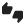|A node for writing boolean logic.|
|[Expression](https://github.com/conneqtDocumentation/connectDocumentation/blob/main/Nodes/Expressions/Expression.md)|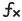|A blank node to be used for a multitude of things.|
||||
|[Load file data from Conneqt](https://github.com/conneqtDocumentation/connectDocumentation/blob/main/Nodes/Save/LoadFileFromConneqt.md)|| Load binary data from conneqt.|
|[Save file data to Conneqt](https://github.com/conneqtDocumentation/connectDocumentation/blob/main/Nodes/Save/SaveFileData.md)|| Save binary data to conneqt.|
|[Save file from the web to Conneqt](https://github.com/conneqtDocumentation/connectDocumentation/blob/main/Nodes/Save/SaveFileFromWeb.md)|| Save a file from the web to conneqt using it's uri.|
||||
|[Assing to asset](https://github.com/conneqtDocumentation/connectDocumentation/blob/main/Nodes/Navigation/AssingToAsset.md)||Have the flow be executed by another asset from this node onwards.|
|[Follow-up flow](https://github.com/conneqtDocumentation/connectDocumentation/blob/main/Nodes/Navigation/RunFollowUpFlow.md)|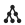|Start another flow after this one ends.|
|[Go to node](https://github.com/conneqtDocumentation/connectDocumentation/blob/main/Nodes/Navigation/GoToNode.md)|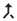|Trace back the steps untill the specified node.|
|[Result action](https://github.com/conneqtDocumentation/connectDocumentation/blob/main/Nodes/Navigation/ResultAction.md)||Execute an action when the flow finishes.|
|[Result complex output](https://github.com/conneqtDocumentation/connectDocumentation/blob/main/Nodes/Navigation/ResultComplexOutput.md)||Create a downloadable file when the flow finishes.|
|[Result navigation](https://github.com/conneqtDocumentation/connectDocumentation/blob/main/Nodes/Navigation/ResultNavigation.md)||Open a dashboard, asset or flow when the flow finishes.|
|[Run dynamic subflow](https://github.com/conneqtDocumentation/connectDocumentation/blob/main/Nodes/Navigation/RunDynamicSubflow.md)||Run a flow inside this flow. Inputs and outputs can be specified.|
|[Run subflow](https://github.com/conneqtDocumentation/connectDocumentation/blob/main/Nodes/Navigation/RunSubflow.md)|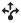|Run a flow inside this flow.|
||||
|[HTTP DELETE](https://github.com/conneqtDocumentation/connectDocumentation/blob/main/Nodes/Network/HTTPDELETE.md)||Perfprms a HTTP DELETE request and returns the data.| 
|[HTTP GET](https://github.com/conneqtDocumentation/connectDocumentation/blob/main/Nodes/Network/HTTPGET.md)||Perfprms a HTTP GET request and returns the data.|
|[HTTP POST](https://github.com/conneqtDocumentation/connectDocumentation/blob/main/Nodes/Network/HTTPPOST.md)||Perfprms a HTTP POST request and returns the data.|
|[HTTP PUT](https://github.com/conneqtDocumentation/connectDocumentation/blob/main/Nodes/Network/HTTPPUT.md)||Perfprms a HTTP PUT request and returns the data.|
||||
|[Button](https://github.com/conneqtDocumentation/connectDocumentation/blob/main/Nodes/UserInterface/Button.md)|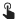|Displays a clickable button on the UI of the flow.|
|[Checkbox](https://github.com/conneqtDocumentation/connectDocumentation/blob/main/Nodes/UserInterface/Checkbox.md)||Displays a clickable checkbox on the UI of the flow.|
|[Data grid](https://github.com/conneqtDocumentation/connectDocumentation/blob/main/Nodes/UserInterface/DataGrid.md)|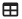|Displays a data grid on the UI of the flow.|
|[Date and time input](https://github.com/conneqtDocumentation/connectDocumentation/blob/main/Nodes/UserInterface/DateAndTimeInput.md)||Displays a date and time picker on te UI of the flow.|
|[Date input](https://github.com/conneqtDocumentation/connectDocumentation/blob/main/Nodes/UserInterface/DateInput.md)||Displays a date picker on the UI of the flow.|
|[Dropdown select list](https://github.com/conneqtDocumentation/connectDocumentation/blob/main/Nodes/UserInterface/DropdownSelectList.md)|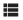|Displays a dropdown selection list on the UI of the flow.|
|[Get geo-location](https://github.com/conneqtDocumentation/connectDocumentation/blob/main/Nodes/UserInterface/GetGeoLocation.md)||Retrieves the geo-location of the user.|
|[Image upload](https://github.com/conneqtDocumentation/connectDocumentation/blob/main/Nodes/UserInterface/ImageUpload.md)||Allows the user to upload an image.|
|[UI Navigate](https://github.com/conneqtDocumentation/connectDocumentation/blob/main/Nodes/UserInterface/UINavigate.md)||Displays a clickable button with a customizable notification badge.|
|[Navigate-maps](https://github.com/conneqtDocumentation/connectDocumentation/blob/main/Nodes/UserInterface/NavigateLocation.md)|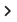|Opens a navigation app and navigates to a specified location.|
|[Numeric input](https://github.com/conneqtDocumentation/connectDocumentation/blob/main/Nodes/UserInterface/NumericInput.md)|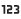|Displays a numeric input field.|
|[Popup message](https://github.com/conneqtDocumentation/connectDocumentation/blob/main/Nodes/UserInterface/PopupMessage.md)||Displays a popup message with clickable buttons.|
|[Signature](https://github.com/conneqtDocumentation/connectDocumentation/blob/main/Nodes/UserInterface/Signature.md)||Allows the user to add a signature.|
|[Text input](https://github.com/conneqtDocumentation/connectDocumentation/blob/main/Nodes/UserInterface/TextInput.md)|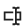|Displays a textual input field.|
||||
|[Clear controls from screen](https://github.com/conneqtDocumentation/connectDocumentation/blob/main/Nodes/Display/CleanControls.md)|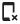|Clears all UI element from the UI of the flow.|
|[Icon](https://github.com/conneqtDocumentation/connectDocumentation/blob/main/Nodes/Display/Icon.md)||Displays an icon with header on the UI of the flow.|
|[Image](https://github.com/conneqtDocumentation/connectDocumentation/blob/main/Nodes/Display/Image.md)||Displays an image on the UI of the flow.|
|[Textual information label](https://github.com/conneqtDocumentation/connectDocumentation/blob/main/Nodes/Display/TextualInformationLabel.md)||Displays text on the UI of the flow.|
|[Textual label](https://github.com/conneqtDocumentation/connectDocumentation/blob/main/Nodes/Display/Label.md)||Displays text and data on the UI of the flow.|

