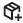
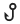

# Modules
Modules allow for exporting part of a tenant for others to use. Creating a module is as simple as clicking the ‘Create Module’ button. Anything can then be moved into the module by clicking the move button  and selecting the module. Openable items can be opened by clicking the open button  . A module can be deleted by pressing the bin button  , renamed with the rename button , a new version can be created using the Create version button   and a sharable token can be made using the generate token button .

To share a module, it needs a version. When a version is made, it shows all the existing and changed dependencies to items outside the module, and it shows the dependencies of all the items in the module in a dependency graph. Creating a sharable token will generate a string of numbers and letters, this is automatically copied to the clipboard.

A module can be installed by pasting a share token into the field that appears after clicking the ‘install module version’ button. When the creator of the module then creates a new version, the module can be updated by clicking the update version button . 