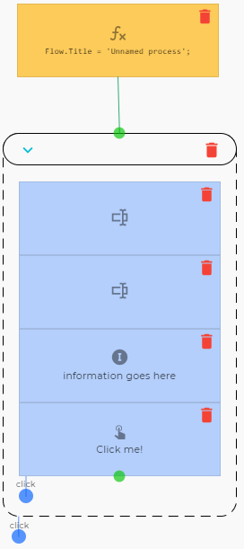
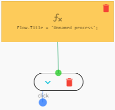

# Form 'node'
A tool to group several nodes. It can be given a name and collapsed. This is not truly a node but more a tool to make flows easier to comprehend. E.g. a large chain of UI elements could be added in a form:

Becomes

