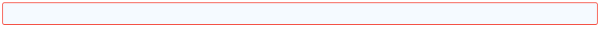

# Button
Displays a clickable button. The button is only clickable if it has a follow up node.
### Node properties
##### Label
Text that will appear on the button. (unchanged it says Click me!)
##### Visible
When this box is checked, the button is visible on the screen.
This may be changed by other nodes to show or hide the option to press the button. This can e.g. be used to have the Flow wait until some action has successfully been performed. Syntax: `Nodes.BooleanNodeName`
##### Validate
When this is checked, the node validates the user input fields that have the ‘mandatory value’ property created by previous nodes. If they haven’t been filled in and the button is pressed, they will be highlighted in red and the rest of the Flow isn’t executed yet:
##### Color
The color of the text
##### Background
The color of the background
##### Fontsize
The size of the font of the text in pt.
##### Height
The height of the button
The button standard spreads the whole screen in width
##### keyCodes
Keys that will trigger this button as if pressed
(Escape, Enter, Home, Back)
### Outputs
The button standard has an output that triggers when the button has been pressed. Any other outputs that are added will never trigger.

# Examples:

[Report a problem](https://github.com/conneqtDocumentation/connectDocumentation/blob/main/Nodes/Examples/ReportAProblem.md)

[Create account](https://github.com/conneqtDocumentation/connectDocumentation/blob/main/Nodes/Examples/CreateAccount.md)

[Desserts](https://github.com/conneqtDocumentation/connectDocumentation/blob/main/Nodes/Examples/Desserts.md)

[Place reservation](https://github.com/conneqtDocumentation/connectDocumentation/blob/main/Nodes/Examples/PlaceReservation.md)
