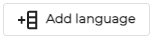

# Translations
The translations allow for a list to be created, and everything this list is added to will be translated to the translations given in the list. This allows for shorthand unique to the writer to be translated into understandable words, allows for translations to different languages to be smoothened and for custom translations for words that don’t have an official translation. 
A new translation file can be created by clicking the button  in the bottom right, and new languages can be added to existing lists by clicking the Add language button.

Words and their translations can then be added in the list by typing in empty fields.

For all fields that can use a translation, a ‘translation file’ option can be selected. 
