# Widgets
Widgets are ways of displaying data within Conneqt. There are many different widgets that all display certain data in a certain way. Widgets can be added to any
Conneqt desktop, assettypes and the menu bar.
## General settings
Some settings are the same for all the widgets:
|Setting||
|-|-|
|Widget header text|Text to be shown in the top left of the widget|
|Text color|The color of the text and icons in the widget|
|Background color|The background color of the widget|
|Icon|The icon to be shown in the top left of the widget|

## Property monitor
This widget keeps track of a property of a single asset. It will display the name of the asset, the name of the property and its value. When creating this asset, first the asset type and asset to keep track of are selected. The property to keep track of is selected separately for easy changing. Clicking the widget will open the asset of which the property is tracked.

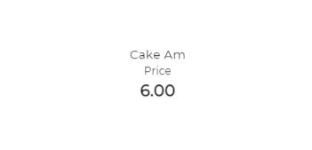

## Multi-property monitor
This widget keeps track of multiple properties of a single asset. It will display the name of the asset, the name of the properties and their values in a list. When creating this asset, first the asset type and asset to keep track of are selected. The properties to keep track of are selected separately with the checkboxes for easy changing. Clicking the widget will open the asset of which the properties are tracked.

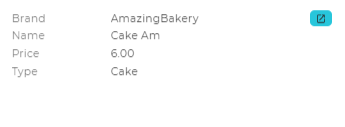

## Property value history.
This widget keeps track of a property of a single asset over time. It will display the name of the asset, the name of the property and its values over time in a graph. When creating this widget, first the asset type and asset to keep track of are selected. The property to keep track of is selected separately for easy changing. Only properties with the ‘Track modification history’ option (see [Assettypes](https://github.com/conneqtDocumentation/connectDocumentation/blob/main/Assettypes.md)) checked can be used. The ‘Time step units’ dedicates the time step of the results that are shown, and the ‘Number of steps’ determines how many timesteps before the latest update are shown. The ‘Calculation’ option sets which value is shown:
|Calculation||
|-|-|
|Count| The amount of updates in the set time step|
|Average| The average value in the set time step|
|Sum| The sum of all the values in the time step|
|Maximum| The highest value in the time step|
|Minimum| The lowest value in the time step|

Clicking the widget will open the asset of which the property is tracked.

    

## Asset location hierarchy
This Widget allows for quick access to an asset by selecting it through a hierarchy. This hierarchy is used to denote when an asset is ‘placed inside’ another asset, and it will thus take on the geo-location of the asset it is ‘placed inside’ if it has one.

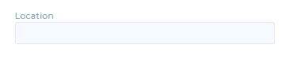

## Location Property
This widget shows an asset on a map using its geo-location property. However, this is not the correct widget for visualizing multiple assets on the same map. When creating this widget, an asset type and asset is chosen. This asset should have a filled geo-location property, otherwise the widget cannot show anything. The ‘Point property’ can either create a pointer at the geo-location by selecting ‘location’ or show a location on a custom map by selecting ‘point on map’. The ‘Map property’ allows for custom maps to be selected. The ‘In-areas property’  cannot be set, rather it is set by conneqt when the geo-location is in a certain area.

There are two options in the view lock mode:
The first: 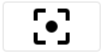 will retain the zoom level when saving the widget. Loading the page will center the map on the geo-location with the saved zoom level.
The seccond: 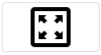 will retain both zoom level and the position of the map. Loading the page will show the same view that the map had when the widget was saved.
The options can be cleared by clicking the cross: 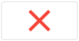

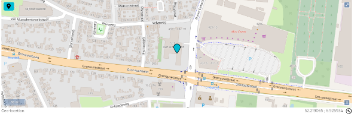

## Filter Data
The filter data shows a filtered set of assets. When creating this widget, a preexisting filter can be set using the ‘filter’ field, or a new filter can be made using the create filter button: 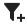 (see [filters](https://github.com/conneqtDocumentation/connectDocumentation/blob/main/Filters.md) for more information). When the ‘Allow add new value’ toggle is turned on, new assets can be made with a click of a button. When the ‘Open as pop-up’ toggle is turned on, the assets will open up as a pop-up message instead of opening the assets page. Different kinds of view modes can be used under ‘view’ (see [Displays](https://github.com/conneqtDocumentation/connectDocumentation/blob/main/Displays.md) for more information) The difference between ‘Filter data’ and ‘Link to filter’ is that ‘Link to filter’ does not show or manipulate any data on the dashboard, while ‘Filter data’ does.

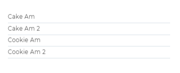

## Link to filter
This widget creates a link to a filter. When creating this widget, a preexisting filter can be set using the ‘ filter’ field, or a new filter can be made using the create filter button:  (see [filters](https://github.com/conneqtDocumentation/connectDocumentation/blob/main/Filters.md) for more information). The widget can also be given an icon to make visualization more clear. When the ‘open as pop-up’ toggle is turned on, the filter will show up in a popup instead of leading to the filter page. The difference between ‘Filter data’ and ‘Link to filter’ is that ‘Link to filter’ does not show or manipulate any data on the dashboard, while ‘Filter data’ does.

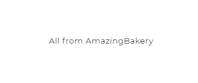

## Real time aggregate
This Widget allows for simple real time calculations to be executed on a filtered property. When creating this widget, a preexisting filter can be set using the ‘ filter’ field, or a new filter can be made using the create filter button. (see filters for more information). Under aggregations, we can select the property to aggregate, and what to calculate. There are 4 options:
- Average
- Maximum
- Minimum
- Sum

A name and icon, as well as colors can be set for better visualization. The color can be determined by the value of the aggregation. Finally, in ‘Data view shown after navigate’ the view that will be visible when clicked on the widget can be set.

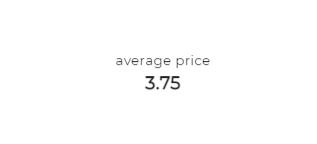

## Real time aggregate data
This Widget allows for simple real time calculations to be executed on filtered assets' properties. When creating this widget, a preexisting filter can be set using the ‘ filter’ field, or a new filter can be made using the create filter button. (see filters for more information). The results can be grouped on the value of one or multiple properties, where all assets with the same property values will be combined. The grouping values will also appear if possible. The groups can be sorted by the values of the properties of the assets.

Under aggregations, we can select the properties to aggregate, and what to calculate. There are 4 options:
- Average
- Maximum
- Minimum
- Sum

Colors can be set for better visualization. The color can be determined by the value of the aggregation.

In ‘Data view shown after navigate’ the view that will be visible when clicked on the widget can be set. When ‘Open as pop-up’ is turned on, this will show up as a pop-up.

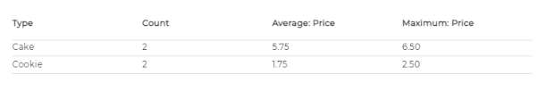

## Real time aggregate chart
This Widget allows for simple real time calculations to be executed on a filtered assets property and to display the result in a bar pie or number graph. The results should be grouped on the value of one or multiple properties, where all assets with the same property values will be combined. If this is not done, all the assets in the filter will be combined into a single result. When creating this widget, a preexisting filter can be set using the ‘ filter’ field, or a new filter can be made using the create filter button. (see filters for more information). Under aggregations, we can select the property to aggregate, and what to calculate. There are 4 options:
- Average
- Maximum
- Minimum
- Sum

Colors can be set for better visualization. The color can be determined by the value of the aggregation. Finally, in ‘Data view shown after navigate’ the view that will be visible when clicked on the widget can be set. When ‘Open as pop-up’ is turned on, this will show up as a pop-up.

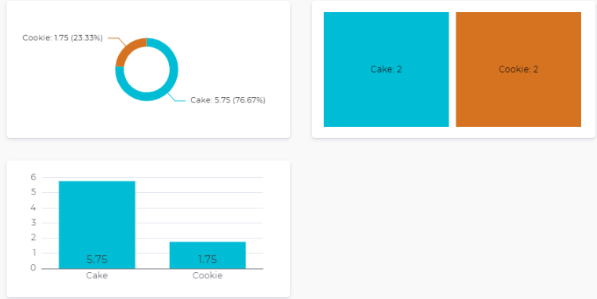

## Custom image
The custom image widget allows for an image to be added to the dashboard. This is done through a URL. In the view mode, the scaling of the image is set. With original size the image will retain its size, even if it falls outside the widget. With resize to cover, the scale is adjusted so that the whole widget is covered with the image, but the scaling happens.

## Custom text
The custom text widget allows for text to be added to a dashboard. The font size slider sets the size of the text, its maximum is based on the size of the tile.

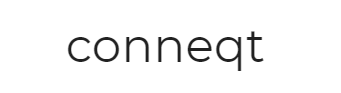

## Process (button or inline)
The process widget allows for a flow to be started from a dashboard with the click of a button. Also, an icon can be set for the button. Toggling the Show UI-process directly in the widget renders all UI elements in the widget instead of in a popup

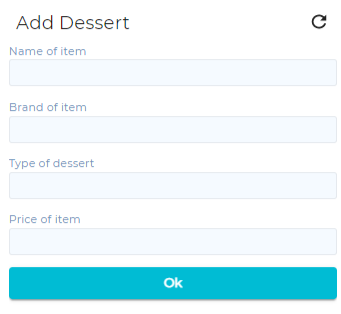

## Link to dashboard
The link to dashboard widget is simply a button that will lead the user to another dashboard.

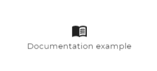
